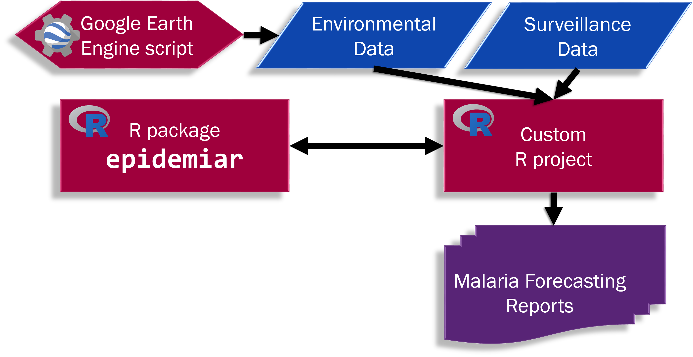

```{r setup, include = FALSE}
knitr::opts_chunk$set(
  collapse = TRUE,
  comment = "#>"
)
```


# Introduction

The Epidemic Prognosis Incorporating Disease and Environmental Monitoring for Integrated Assessment (EPIDEMIA) Forecasting System is a set of tools coded in free, open-access software, that integrate surveillance and environmental data to model and create short-term forecasts for environmentally-mediated diseases. 

## Issues/Background
1. Public health monitoring of environmentally-mediated diseases can benefit from incorporating information on related environmental factors. This melding of data can improve the ability to detect early indication of outbreaks, allowing for more efficient and proactive public health interventions.
2. The EPIDEMIA project integrated local malaria surveillance data and remotely-sensed environmental predictors to produce operational malaria forecasts for the Amhara region of Ethiopia. Our local public health partners expressed interest in being self-sufficient in creating the weekly reports themselves.

## Our Solution
The EPIDEMIA modeling of disease transmission for early detection and early warning evaluation was done in R, a free software for statistical computing. We developed the “epidemiar” R package to provide a generalized set of functions for disease forecasting. In addition, we designed workflows and wrote customized code for our Ethiopian colleagues, including a Google Earth Engine script to capture the necessary summaries of the environmental variables. The output of the modeling and forecasting is fed into formatting documents to create distributable reports with maps and graphs of the results.

## System Components
The full system can be thought of have 3 (three) main parts:

```{r echo = FALSE, out.width = "75%", `fig.cap = "System diagram of the EPIDEMIA Forecasting System."`}

```

1.	R package epidemiar: Library of flexible functions for modeling and forecasting
2.	Google Earth Engine script: Script to gather the environmental data summaries
3.	Custom R Project: Contains the surveillance and environmental data, user parameters on the model and outbreak detection algorithm, and script to produce a finalized report. 

This is the first component, the R package `epidemiar`. For example GEE scripts and R project, see the `epidemiar-demo` repository at https://github.com/EcoGRAPH/epidemiar-demo.

## Modeling Overview

The model is based on a general additive model (GAM) regression of multiple factors, including the geographic group, long terms trends, seasonality, lagged environmental drivers,and clustering of geographic groups. 

$casecount ~ geo + 
    bs_1 * geo + 
    bs_2 * geo + 
    bs_3 * geo + 
    bs_4 * geo + 
    bs_5 * geo + \\
    ~~~s(doy, bs = "cc", by = geo) + \\
    ~~~env_1 summary_1 * cluster + 
    env_1 summary_2 * cluster +  
    env_1 summary_3 * cluster + \\ 
    ~~~~~~var_1 summary_4 * cluster + 
    env_1 summary_5 * cluster + \\ ...
    ~~~env_n summary_1 * cluster + 
    env_n summary_2 * cluster + 
    env_n summary_3 * cluster + \\ 
    ~~~~~~env_n summary_4 * cluster + 
    env_n summary_5 * cluster$

where _geo_ is the geographic group, bs_1 ... bs_5 are modified basis functions, _doy_ is the day of the year, _env_ are the environmental variables (1, 2 ... n) and the 5 summary statistics from the lagged basis functions, and _cluster_ is the cluster identification of that geographic group. See the following sections for more details. 

# Geographic group, long term trends and seasonality

Geographic group: $geo$ 

Long term trends:
$bs_1 * geo + bs_2 * geo + bs_3 * geo + bs_4 * geo + bs_5 * geo$ 

Seasonality:

$s(doy, bs = "cc", by = geo)$


# Environmental Variables

The rates of environmentally-mediated infectious diseases can be influenced by the environmental factors via a range of potential mechanisms, e.g. affecting the abundance and life cycle of disease vectors. The influences on disease generally lags behind the changes in the environmental covariates. 

<<>><<>> Anomalies


In the modeling controls, the user selects the maximum number of days in the past (lag length, _l_) to consider interactions.  Each geographic unit (group) and week is associated with environmental values on the day the week began, up to the lag length, _l_, so that each group-week has a _l_-day history of weather data. A distributed lag basis is created with the natural cubic splines function (ns, splines library), including intercept, with knots at 25%, 50%, and 75% of the lag length. The 5 basis functions that result are multiplied by each group's history, so that there are just 5 summary statistics, instead of _l_, for every combination of group, week, and environmental covariate. 


# Clusters

"However, malaria-environment relationships can vary with ecological and social context. We
20 used a genetic algorithm to optimize a spatiotemporal malaria model by grouping locations into
21 geographic strata with similar environmental sensitivities" --from paper

spatial non-stationarity
relationship between env var and disease vary gegraphically
global model - not capture spatial variation of environmental influenes, poorer model fit
each geographic unit own model - can lead to overfitting noisy data or short timeseries
Determination of clustering of geographic units can be done in any way the user prefers. 
Some ecological zones, similar temporal disease patterns. 
For the malaria EPIDEMIA project, selection of  which environmental variabls and clustering based on responses to those environmental variables was performed at the same time using a genetic algorithm [CITE DAVIS pre?]


## Event Detection Overview


# Data Requirements

## Epidemiology Data

## Environmental Data

## Environmental Reference / Weekly Climate Data

## Reference Tables
1. Environmental variables
2. Model variables and geographic group clusters
3. Population
4. Shapefiles


# Setting up the Model

## Environmental variables
## Geographic grouping clusters

# Setting up for Event Detection
1. Picking the algorithm
1. Settings .... 

# Running epidemiar


# Creating the Report

Steps to Run Report: In brief, after user parameters and model specifications have been set, users follow these steps to create reports:
1.	update their surveillance data, 
2.	update environmental data,
3.	open the Custom R Project and run a script that will read in the data, run the model, produce the forecasts, and format the finalized report. 


Vignettes are long form documentation commonly included in packages. Because they are part of the distribution of the package, they need to be as compact as possible. The `html_vignette` output type provides a custom style sheet (and tweaks some options) to ensure that the resulting html is as small as possible. The `html_vignette` format:

- Never uses retina figures
- Has a smaller default figure size
- Uses a custom CSS stylesheet instead of the default Twitter Bootstrap style

## Vignette Info

Note the various macros within the `vignette` section of the metadata block above. These are required in order to instruct R how to build the vignette. Note that you should change the `title` field and the `\VignetteIndexEntry` to match the title of your vignette.

## Styles

The `html_vignette` template includes a basic CSS theme. To override this theme you can specify your own CSS in the document metadata as follows:

    output: 
      rmarkdown::html_vignette:
        css: mystyles.css

## Figures

The figure sizes have been customised so that you can easily put two images side-by-side. 

```{r, fig.show='hold'}
plot(1:10)
plot(10:1)
```

You can enable figure captions by `fig_caption: yes` in YAML:

    output:
      rmarkdown::html_vignette:
        fig_caption: yes

Then you can use the chunk option `fig.cap = "Your figure caption."` in **knitr**.

## More Examples

You can write math expressions, e.g. $Y = X\beta + \epsilon$, footnotes^[A footnote here.], and tables, e.g. using `knitr::kable()`.

```{r, echo=FALSE, results='asis'}
knitr::kable(head(mtcars, 10))
```

Also a quote using `>`:

> "He who gives up [code] safety for [code] speed deserves neither."
([via](https://twitter.com/hadleywickham/status/504368538874703872))
