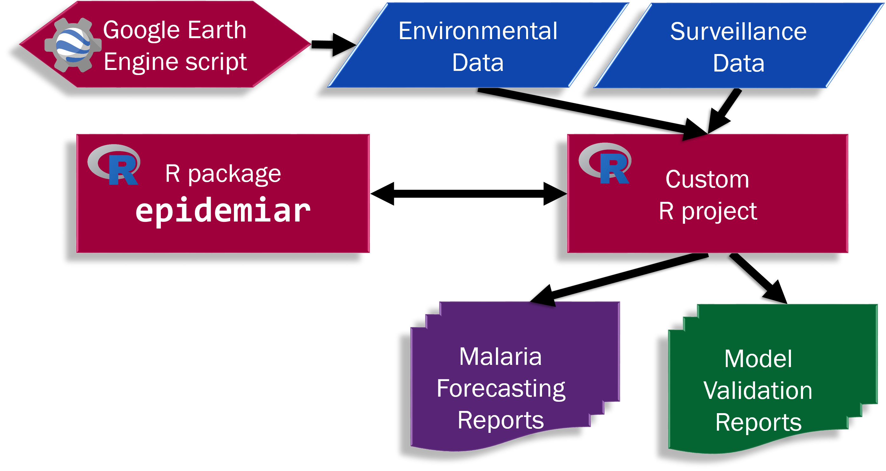

```{r setup, include = FALSE}
knitr::opts_chunk$set(
  collapse = TRUE,
  comment = "#>"
)
```


# Introduction

The Epidemic Prognosis Incorporating Disease and Environmental Monitoring for Integrated Assessment (EPIDEMIA) Forecasting System is a set of tools coded in free, open-access software, that integrate surveillance and environmental data to model and create short-term forecasts for environmentally-mediated diseases. 

This R package, `epidemiar`, is the cornerstone of the forecasting system, and is designed to be used to model and forecast a wide range of environmentally-mediated diseases. 

## Issues/Background
1. Public health monitoring of environmentally-mediated diseases can benefit from incorporating information on related environmental factors. This melding of data can improve the ability to detect early indication of outbreaks, allowing for more efficient and proactive public health interventions.
2. Originally, the EPIDEMIA project integrated local malaria surveillance data and remotely-sensed environmental predictors to produce operational malaria forecasts for the Amhara region of Ethiopia. Our local public health partners expressed interest in being self-sufficient in creating the weekly reports themselves.

### Our Solution
The EPIDEMIA modeling of disease transmission for early detection and early warning evaluation had been done in R. We developed the “epidemiar” R package to provide a generalized set of functions for disease forecasting. 

In addition, we designed workflows and wrote customized code for our Ethiopian colleagues, including a Google Earth Engine script to capture the necessary summaries of the environmental variables. The output of the modeling and forecasting is fed into formatting documents to create distributable reports with maps and graphs of the results. A version of this code is being released as `epidemiar-demo`: https://github.com/EcoGRAPH/epidemiar-demo.

## System Components
The full system can be thought of have 3 (three) main parts:

```{r echo = FALSE, out.width = "75%", `fig.cap = "System diagram of the EPIDEMIA Forecasting System."`}

```

1.	R package `epidemiar`: This package - a library of flexible functions for modeling, forecasting, and model validation
2.	Google Earth Engine script: A GEE script to gather the environmental data summaries
3.	Custom R Project: Contains the surveillance and environmental data, user parameters on the model and outbreak detection algorithm, and script to produce a finalized report (or validation report if validation functions were run). 

This package can be used for modeling and forecasting for a variety of environmentally-mediated disease. 
For example GEE scripts and R project, see the `epidemiar-demo` repository at:
https://github.com/EcoGRAPH/epidemiar-demo/releases/latest.

The main requirements for using this package are:

* Surveillance / disease case counts: per week per geographic group (if present)
* Daily environmental data: per geographic group with enough lead time for lagged effects (user set time period)
* Pre-identified model: which environmental covariates to include, any clustering of geographic groups, etc. 

# Modeling Overview

The epidemiar package is flexible on many aspects of modeling. It is all based on general additive model (GAM) regression of multiple factors, including lagged environmental drivers, long term trends, and potentially several other factors such as geographic group, seasonality, and clustering of geographic groups. 

The modeling utilizes `mgcv::bam()`, so the model form can be any accepted by it - any quadractically penalized GLM with the extended families in family.mgcv also being available. This is user set with the `fc_model_family` parameter. For example, you can run regression with a Poisson distribution (`fc_model_family = "poisson()"`) or a Gaussian (`fc_model_family = "gaussian()`). For a Gaussian or other relevant models, there is also a log(cases)+1 transformation (and corresponding back-transformation of predicted values) with `epi_transform = "log_plus_one`. 

## Timeframes

The timeframes of the modeling results/report are by default based around the date of last known/observed epidemiological data. This last known date drives when the forecast (future) period begins. The function will forecast `report_settings$fc_future_period` weeks beyond the last known date. The entire report will be a length of `report_settings$report_period` weeks, with the last `report_settings$fc_future_period` weeks as the forecast, and therefore showing the last `(report_settings$report_period - report_settings$fc_future_period)` weeks of known data before the start of the forecast. 

However, it is also possible to specify a custom forecast start date (the equivalent date of one week past the last known epidemiological data) using the parameter `report_settings$fc_start_date`, irrespective of when epidemiological data exists. All other time periods will adjust as above around this forecasting start date instead. Note that model accuracy decreases without recent epidemiological data, and that there may be no known data (and therefore results) for 'early detection' in the event detection section. 


## Geographic group, long term trends, and seasonality

Each geographic group, $geo$, identified in the `groupfield` column is included as a factor. 

Each geographic group also has a long term trend component. The long-term trend (and the lagged environmental data, see below) has two options. 

Option 1) This is the recommended option. With the installation of a companion package (`clusterapply`), thin plate splines are used instead (`report_settings$fc_splines = "tp"` and the default when `clusterapply` is installed). A smooth term is created for length of history for that geogroup: $s(censorednumericdate, bs = "tp", by = geo)$. The covariate (the date variable) is frozen at the end of the known data. This has the effect of freezing the long-term trend: the trend value is carried persistently to the end of the forecast period and does not suffer from spline edge effects (evolving beyond the domain). 

Option 2) Using modified b-splines (`report_settings$fc_splines = "modbs"`), where $geo$ is multiplied by each of 5 modified basis splines: $bs_1 * geo + bs_2 * geo + bs_3 * geo + bs_4 * geo + bs_5 * geo$. 
The modified basis splines are created by first using `splines::bs()` to create basis splines over the range of observations with degree 6. Then to reduce the edge effects of using splines, the following modifications are performed: the last basis spline function is reverse, and the second to last basis spline function is removed. 

There is a an option to explicitly include a cyclical for account for seasonality. If `report_settings$fc_cyclicals` is set to TRUE (default is FALSE), a cyclical cubic regression spline smooth is added based on day of year. There is also a setting `report_settings$fc_cyclicals_by` for the unit to calculate the cyclicals by. By default, these cyclicals are calculated per cluster ('cluster'; clusters given in `report_settings$fc_clusters`, see below): $s(doy, bs = "cc", by = clusterid)$. The other option is by 'group' (per geogroup in `groupfield`): $s(doy, bs = "cc", by = geo)$. 

If there is only one geogroup, all of these equation pieces are modified accordingly. 

## Environmental Variables

The rates of environmentally-mediated infectious diseases can be influenced by the environmental factors via a range of potential mechanisms, e.g. affecting the abundance and life cycle of disease vectors. The influences on disease generally lags behind the changes in the environmental covariates. 

In the modeling controls, the user selects the maximum number of days in the past (`report_settings$env_lag_length`, _l_) to consider interactions.  Each geographic group and week is associated with environmental anomaly values on the day the week began, up to the lag length, _l_, so that each group-week has a _l_-day history. These are then used in modeling per cluster, see next section for details. 

In our modeling options, it is possible to specify that the _anomalies_ of the environmental covariates are used as factors (`fc_control$env_anomalies = TRUE`, the default is false to run with raw actual values). In some case, you may want to look at the influence of deviation from normal in the environmental factors to help explain deviations from normal in the disease cases. The variables were transformed by taking the residuals from a GAM with geographic unit and cyclical cubic regression spline on day of year per geographic group: $geo + s(doy, bs="cc", by=geo)$


## Clusters

The relationship between environmental drivers and the case burden of the environmentally-mediated disease can vary with geographically, due to ecological, social or other geographic factors. This potential spatial non-stationarity could be handled in a number of ways.  

If you were working with areas not likely or shown not to have spatial non-stationarity between environmental covariates and disease rates, you could use a global model (all geographic groups in one cluster). However, if there are spatial variations in environmental influence, this could yield a poorer model fit. 

On the other extreme, you could run separate models for each geographic group (each geographic group as its own cluster). However, especially with noisy data or short time-series, this could lead to overfitting.

We allow the user to identify their own clusters of geographic units with `report_settings$fc_clusters`, a table of geographic unit and a cluster id (see data vignette for full format details). The clustering determination can be done prior however the user chooses - for example, global model, individual models, clustering by ecological zones, or by identifying similar temporal disease patterns. By default, without information in `fc_clusters`, the model will run as a global model (one cluster).  

For modeling the lagged environmental drivers by cluster, there are two options:

Option 1) This is the recommended option. With the installation of a companion package (`clusterapply`), thin plate splines are used instead (`report_settings$fc_splines = "tp"` and the default when `clusterapply` is installed). The `clusterapply` package is our wrapper over some of the mgcv functions so that we can use thin plate splines for each lagged environmental variable by cluster. Thin plate splines are more effective at capturing complex, non-linear relationships and our preliminary analyses show that using thin plate splines produce better predictions without over-fitting. To allow for clusters that may have only one geogroup in that cluster, a fall-back equation without geogroup as a factor is also constructed and tried in case of model failure. 

Option 2) Using modified b-splines (`report_settings$fc_splines = "modbs"`), a distributed lag basis is created with the natural cubic splines function (ns, splines library), including intercept, with knots at 25%, 50%, and 75% of the lag length. The 5 basis functions that result are multiplied by each group's history, so that there are just 5 summary statistics, instead of lag length, for every combination of group, week, and environmental anomaly co-variate. 


## Model Caching Option

The results of `run_epidemiar()` with `report_settings$model_run = TRUE` is a cached model: the regression object plus some metadata information about what was used to generate the model. 
Once a model has been generated, it can be fed back into `run_epidemiar()` with `report_settings$model_cached = {cached model object}` for faster predictions rather than regenerating the model on each run. Determining the balance on how old of a model is still useful is heavily dependent on the specific dataset. 


# Event Detection Overview

The central idea behind outbreak detection is to identify when the case volume exceeds a baseline threshold, and to use this information in a prospective (not retrospective) manner to identify epidemics in their early stages.

Currently, epidemiar supports the Farrington improved algorithm for event detection, using `Farringtonflexible()` from the `surveillance` package by setting `report_settings$ed_method = "farrington"`. 

This family of methods developed by Farrington and later, Noufaily, have been implemented at several European infectious disease control centers. Farrington methods are based on quasi-Poisson regression and can take advantage of historical information while accounting for seasonality, long-term trends, and previous outbreaks. 

The Farrington improved method offer parameters to control various model settings, such as the number of time points to include in the historical window through a specified number of years, the number of knots in the splines to account for seasonality, and the number of weeks to exclude at the beginning of the evaluation period (for events that may already be in progress). These can be set using `report_settings$ed_control`, though `surveillance` package defaults will generally be used if not set. See the data & modeling vignette for more details. Note, the Farrington method does generally require several years of historical data.

Alerts are generated by the Farrington algorithm run over the entire time length of the report on the number of cases, observed or future forecast (optionally adjusted for population).  

**Early Detection** alerts are alerts that are triggered during the early detection period, a user set number of week of the most recently known epidemiological data (case counts) via `report_settings$ed_summary_period`. 

**Early Warning** alerts are alerts that are triggered in the future forecast (`report_settings$fc_future_period`) estimates (early warning period). These early warning alerts indicate that the environmental conditions are favorable (or unfavorable) for abnormally high case counts, based on past trends.

Alerts per week per geographic group are recorded. As the algorithm runs over the entire length of the report, historical alerts (weeks included in the report that are prior to the early detection period) are also marked. 


Alert summaries are also created for the early detection and early warning periods (separately). "High" level indicates two or more weeks in this period had incidences greater than the alert threshold, "Medium" means that one week was in alert status, and "Low" means no weeks had alerts.


# References

Davis JK, Gebrehiwot T, Worku M, Awoke W, Mihretie A, Nekorchuk D, Wimberly MC. A genetic algorithm for identifying spatially-varying environmental drivers in a malaria time series model. Environmental Modelling & Softare. 2019; 119:275-284. 

Farrington CP, Andrews NJ, Beale AD, Catchpole MA. A Statistical Algorithm for the Early Detection of Outbreaks of Infectious Disease. J R Stat Soc Ser A Stat Soc. 1996;159:547–63. 

Höhle M. surveillance: An R package for the monitoring of infectious diseases. Comput Stat. 2007;22:571–82.

Hulth A, Andrews N, Ethelberg S, Dreesman J, Faensen D, van Pelt W, et al. Practical usage of computer-supported outbreak detection in five European countries. Eurosurveillance. 2010;15:19658. 

Merkord CL, Liu Y, Mihretie A, Gebrehiwot T, Awoke W, Bayabil E, Henebry M, Kassa GT, Lake M, Wimberly WC. Integrating malaria surveillance with climate data for outbreak detection and forecasting: the EPIDEMIA system. Malar J. 2017;16.

Noufaily A, Enki DG, Farrington P, Garthwaite P, Andrews N, Charlett A. An improved algorithm for outbreak detection in multiple surveillance systems. Stat Med. 2013;32:1206–22.

<!-- # References

generic env var -- disease??.  malaria 5-8 davis
ecozones 9?

[5] G. Stresman, "Beyond temperature and precipitation: ecological risk factors that modify malaria
transmission," Acta Tropica, vol. 116, no. 3, pp. 167-172, 2010.

[6] A. Midekisa, G. Senay, G. Henebry, P. Semuniguse and M. Wimberly, "Remote sensing-based time
series models for malaria early warning in the highlands of Ethiopia," Malaria Journal, vol. 11, no.
165, 2012.

[7] R. Lowe, J. Chirombo and A. Tompkins, "Relative importance of climatic, geographic and socioeconomic
determinants of malaria in Malawi," Malaria Journal, vol. 12, no. 416, 2013.

[8] K. Zinszer, R. Kigozi, K. Charland, G. Dorsey, T. Brewer, J. Brownstein, M. Kamya and D. Buckeridge,
"Forecasting malaria in a highly endemic country using environmental and clinical predictors,"
Malaria Journal, vol. 14, no. 245, 2015.

[9] A. Midekisa, B. Beyene, A. Mihretie, E. Bayabil and M. Wimberly, "Seasonal associations of climatic
drivers and malaria in the highlands of Ethiopia," Parasites & Vectors, vol. 8, no. 339, 2015.
<<>>

--> 
